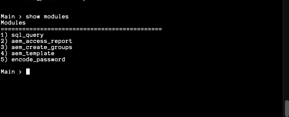

# Welcome to the Interactive Framework

## Summary
The Interactive Framework was created to modulate existing scripts into a single toolset. 
The Framework will dynamically import modules from the module directory, provide recommendations on
commands, and allow you to run a module interactively or run with the necessary arguments from the main menu. 

Alternatively, a flag is added to the `aem_util.py` script so you can run your module and arguments in a single command.
This is useful when designing jenkins jobs or other scheduled automation tasks.

## Project layout
- `aem_util.py` _(Script Calls the actual framework with an easy to use name)_  
- **base/**  
    - `main.py` _(Main script for Interactive Framework)_ 

    - **core/**   _(Directory for Core Framework Modules)_ 
        - `get_arguments.py`  _(Module That Defines arguments for main.py)_ 
        - `pyCommon.py`  _(Module That Defines common imports and variables for import)_ 

    - **modules/**  _(Directory to store Modules)_ 
        - `encode_password.py`  _(Module to encode / decode passwords)_ 
        - `sql_query.py` _(Module to perform SQLite3 queries and return results)_ 
        - `<Your Custom Module Here>`

## How to Run
To Run, simply run python and the `aem_util.py` like so: 
`python /path/to/aem_util.py`  

To execute in a single command and avoid running the main menu, Simply use the -m argument. 
This example runs the `sql_query.py` module with multiple arguments
Example: `python3 aem_util.py -m "encode_password --encode test"`

###Main Menu + recommendations:

###Dynamically Import Modules without changing code:

###Run Module Interactive:
   

###Module Help / Acceptable Arguments:

###Execute Module With Acceptable Arguments:

###Exit Module:

